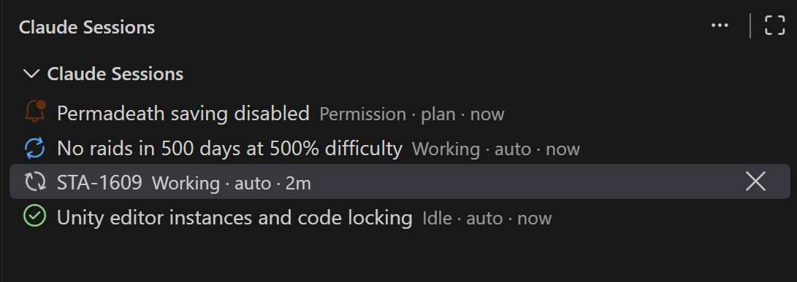

# Claude Master

A compact, dockable list of the Claude Code sessions running in **this VS Code window**, with live status.



| Icon | Status | Meaning |
|---|---|---|
| spinning, blue | Working | Claude is working on a turn |
| bell, orange | Permission / Input | Claude is waiting for you: a permission prompt or a question |
| spinning, purple | N agents running | The turn is over, but background subagents are still running |
| check, green | Idle | Finished, waiting for your next prompt |
| slashed circle, grey | Closed | The session's Claude process has ended |

Each row also shows the session's permission mode (`auto`, `plan`, `edits` for accept-edits, `ask` for the default mode) and how many subagents are running, e.g. `Working · auto · 2 agents · 3m`. Hover a row for details.

The mode is taken from the most recent of: the mode recorded with each prompt, the mode-change entries Claude writes to the transcript, and the mode you last picked in Claude's UI. Right after a plan is approved into a mode other than auto, Claude records nothing, so the label stays blank until the next prompt.

- **Click** a row to switch the Claude Code sidebar view to that session, like picking it from Claude's session history. Closed sessions are resumed. For this to work, clicking sets `claudeCode.preferredLocation` to `sidebar`, which is what Claude's own "Open in Side Bar" command does. If the session is open in its own Claude editor tab, that tab is shown instead.
- **Untitled** is a session with no prompt yet; only the newest one is listed. Claude Code keeps such a session without an id until its first prompt, and asking it to switch to an id it doesn't know makes it start another blank session. So clicking Untitled only shows the Claude view. If another session is showing there, pick the Untitled one in Claude's own session list.
- **×** on hover (or the right-click menu) removes a session from the list. It comes back as soon as anything new happens in it: a prompt, a reply, a slash command, a finished agent. Closing or resuming a session (e.g. reloading the window) doesn't count.
- **Clear all** in the title bar removes every Idle and Closed session; **Restore Removed Sessions** is in the `…` menu.
- The view can be dragged anywhere: the bottom Panel, the Secondary Side Bar, or another view container.
- The badge counts the sessions waiting for you.

## How it works

The extension relies on Claude Code internals (observed in version 2.1.284), not a public API, so a Claude Code update can break it:

- `~/.claude/sessions/<pid>.json`: one file per running Claude process, with `status` (`busy`/`waiting`/`idle`) and `waitingFor`. A session belongs to this window when its process's parent is this window's extension host.
- `~/.claude/projects/<folder>/<sessionId>.jsonl`: the transcript. It provides the title (`ai-title`) and reports when agents finish.
- `~/.claude/projects/<folder>/<sessionId>/subagents/`: one transcript and meta file per subagent.
- Clicking runs Claude's `claude-vscode.editor.open` command with the session id.

The **Claude Master** output channel logs every change in the list.

## Build

```sh
npm install
npm test          # compile + unit tests
npm run package   # produces claude-master-<version>.vsix
code --install-extension claude-master-<version>.vsix
```

Or press F5 to run it in an Extension Development Host.
